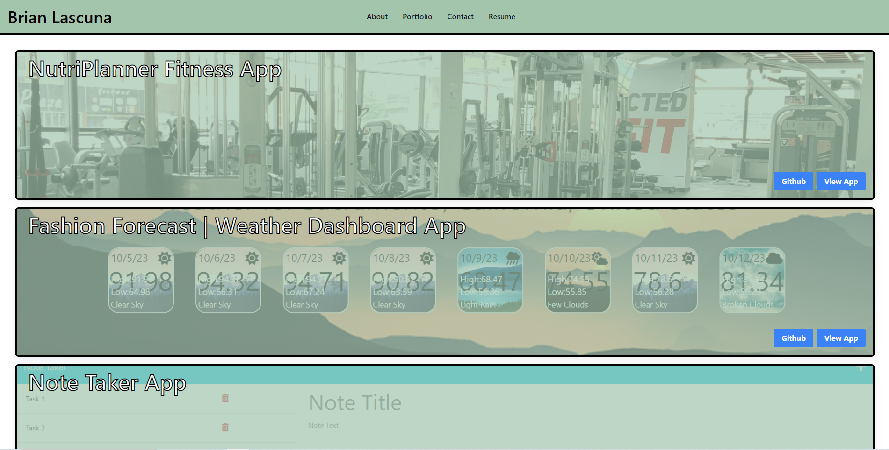

# React Portfolio

## Description
A React app used to create a personal portfolio, showcasing myself and all the featured projects that I have worked on while, at the same time, practicing the usage of React to create a portfolio that can stand out from the rest. The portfolio showcases an About page as well as three different projects at the time of deployment. More projects will be added later as I continue to work on them. Visitors can also submit a form to allow me to contact them at a later date and be able to view and download my resume.

## Installation
All packages are installed on the deployed webpage, users viewing it on their local machine must use the 'npm install' or 'npm i' commands.

## Usage
Visitors will be brought to the 'About' page upon loading the webpage. The navbar at the top allows you to navigate through the webpage, allowing access to the actual portfolio, the contact page, and resume page. Projects featured in the portfolio have respective buttons for viewing the repository and the deployed app itself. The contact page requires a name and email with the message being optional. A PDF of my resume can be viewed in the resume page and can be downloaded for personal viewing.

The portfolio can be viewed [here](https://brian-lascuna.github.io/react-portfolio/).

# Credits
N/A

# License
N/A